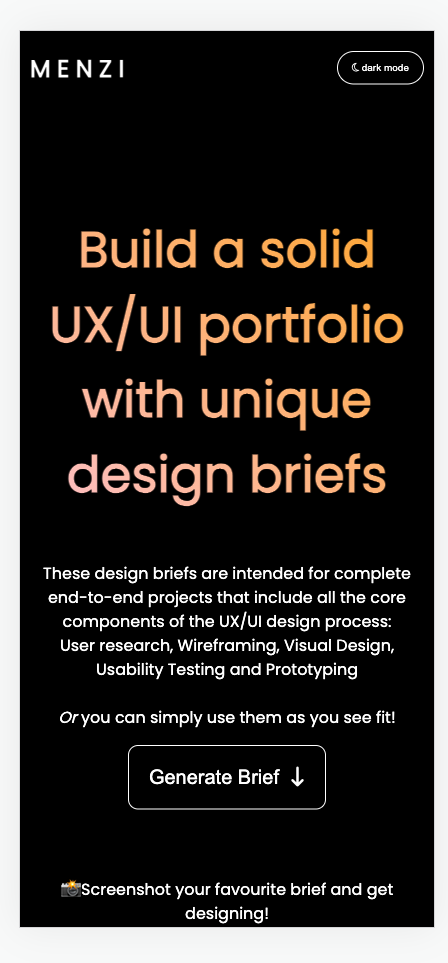

# Menzi: UX/UI Design Brief Generator Website

## Description

This is the coded prototype for my UX/UI project Menzi - a design brief generator website which helps new and aspiring UX/UI designers to practice their skills and build a strong portfolio. 

During the initial stages of the design process, I discovered that current brief generator websites significantly lack UX briefs and there is none that is exclusively for UX/UI Designers. Menzi was created to address this.

The website was created with a simple and minimalistic design, with users only having to tap one button to complete the task. The code also follows web accessibility standards, such as using semantic HTML elements, using alt attributes for images and icon elements and providing a descriptive title to the webpage. 

Languages used:  
  

 
 

<b>View the live prototype: https://margaretalice-a.github.io/menzi-project/</b>

[Full details about the project is coming soon]

## Usage

This website works by simply clicking the "Generate Brief" button in the center of the page, which will generate a random design brief below with each new click. 

This website can be viewed in light mode or dark mode. As it has a responsive web design, it will adjust automatically to different screen sizes. 

### Light Mode Version 

### Dark Mode Version 

### Mobile Version

## Installation

N/A

## Credits

N/A

## License

Please refer to the LICENSE in the repo.
